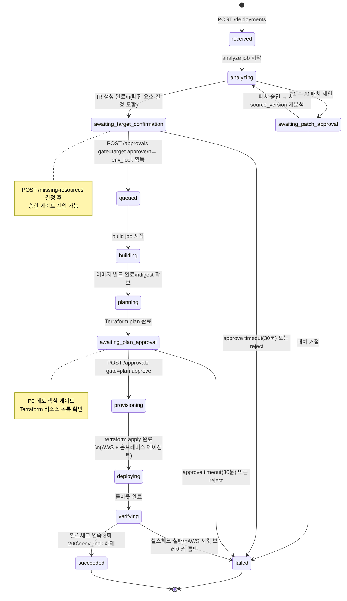

# API Spec v0 — Auto Deployment System

> 대상 독자: **프론트엔드 개발자 김민성**
> 기준 아키텍처: v5.4.1 (2026-09-29/30)
> 작성일: 2026-09-30
> 스택: TypeScript · Fastify · Zod · pg-boss (D-52/53)
> 상태: 초안 — P0 데모 완주 기준

---

## 목차

1. [공통 규칙](#1-공통-규칙)
   - 1.1 Base URL / 버전
   - 1.2 인증
   - 1.3 에러 응답 형식
   - 1.4 페이지네이션
   - 1.5 타임스탬프 · ID
   - 1.6 공통 헤더
2. [용어](#2-용어)
3. [상태 머신 다이어그램](#3-상태-머신-다이어그램)
4. [SSE 이벤트 스키마](#4-sse-이벤트-스키마)
5. [인증 (P1)](#5-인증-p1)
   - POST /auth/session
6. [프로젝트](#6-프로젝트)
   - POST /projects
   - GET /projects
   - GET /projects/:id
7. [배포](#7-배포)
   - POST /deployments
   - GET /deployments/:id
   - GET /deployments/:id/events (SSE)
   - GET /deployments/:id/ir
   - PATCH /deployments/:id/ir
   - POST /deployments/:id/missing-resources
   - POST /deployments/:id/approvals
   - GET /deployments/:id/logs
   - POST /deployments/:id/rollback (P1)
   - POST /deployments/:id/switch (P1)
8. [에이전트 (온프레미스)](#8-에이전트-온프레미스)
   - GET /agent/jobs
   - POST /agent/jobs/:id/result
9. [에러 코드 목록](#9-에러-코드-목록)
10. [packages/contracts 재사용 가이드](#10-packagescontracts-재사용-가이드)
11. [미결 항목](#11-미결-항목)

---

## 1. 공통 규칙

### 1.1 Base URL / 버전

```
https://<control-plane-host>/api/v1
```

- 로컬 개발: `http://localhost:3000/api/v1`
- 버전은 URL 경로로 관리. 하위 호환 변경은 버전 올리지 않음.

### 1.2 인증

> **P1 — 당분간 API Key 헤더로 가정.** 풀 인증 플로우(POST /auth/session)는 5절 참고.

```
Authorization: Bearer <api_key>
```

- 모든 엔드포인트(에이전트 경로 포함)에 필수.
- 미제출 → `401 UNAUTHORIZED`
- 권한 부족 → `403 FORBIDDEN`

### 1.3 에러 응답 형식

v5.4.1 원칙: **hint = 다음 행동 유도**. 프론트는 `error.hint`를 사용자에게 그대로 노출해도 된다.

```typescript
// packages/contracts/src/errors.ts
import { z } from "zod";

export const ApiErrorSchema = z.object({
  error: z.object({
    code: z.string(),          // 기계 판독용 스네이크_케이스
    message: z.string(),       // 사람 읽기용
    hint: z.string().optional(), // 다음 행동 유도 문구
  }),
  requestId: z.string(),       // X-Request-Id 헤더와 동일
});

export type ApiError = z.infer<typeof ApiErrorSchema>;
```

예시:
```json
{
  "error": {
    "code": "DEPLOYMENT_LOCKED",
    "message": "이 환경에 이미 진행 중인 배포가 있습니다.",
    "hint": "GET /deployments/:id 로 현재 배포 상태를 확인하세요."
  },
  "requestId": "req_01j9x3k2mn4pq5rs6tu7vw8x"
}
```

### 1.4 페이지네이션

목록 API는 커서 기반 페이지네이션을 사용한다.

```typescript
// packages/contracts/src/pagination.ts
import { z } from "zod";

export const PaginationQuerySchema = z.object({
  cursor: z.string().optional(),  // 이전 응답의 nextCursor
  limit: z.coerce.number().int().min(1).max(100).default(20),
});

export const PaginatedResponseSchema = <T extends z.ZodTypeAny>(itemSchema: T) =>
  z.object({
    items: z.array(itemSchema),
    nextCursor: z.string().nullable(), // null이면 마지막 페이지
    total: z.number().int().optional(), // 비용 크면 생략 가능
  });
```

### 1.5 타임스탬프 · ID

- 모든 타임스탬프: **ISO 8601 UTC** (`2026-09-30T03:15:00.000Z`)
- ID: **BIGINT** (D-27). 외부 노출 시 문자열로 직렬화 (`"id": "42"`).
  - Q-08: UUID 전환 미결 — 프론트는 `string` 타입으로만 쓸 것.
- `requestId`: `req_` 접두사 + ULID 26자.

### 1.6 공통 헤더

| 헤더 | 방향 | 설명 |
|------|------|------|
| `Authorization` | 요청 | `Bearer <api_key>` |
| `Content-Type` | 요청 | `application/json` (multipart 예외) |
| `X-Request-Id` | 응답 | 요청 추적용. 에러 신고 시 이 값을 함께 전달 |
| `X-RateLimit-Remaining` | 응답 | 잔여 요청 수 (P1) |

---

## 2. 용어

| 용어 | 설명 |
|------|------|
| **IR** (Intermediate Representation) | 클라우드 중립 앱 명세 YAML. 서비스 유형·포트·헬스·env·시크릿·리소스·크기·expose 포함. 프로바이더 어댑터 입력. |
| **프로필** | 환경별 검증된 인프라 골격 + capabilities 선언. `aws-ecs-basic` / `onprem-docker-basic`. |
| **env_lock** | 환경 단위 배타 락. target 승인 직후 획득, 배포 완료 또는 lease 만료 시 해제. |
| **digest** | 이미지 SHA256 식별자. 한 번 빌드 → AWS ECS + 온프레미스가 동일 digest pull. |
| **에이전트** | 온프레미스 서버에서 실행되는 Pull 폴링 컴포넌트. 컨트롤 플레인에 롱 폴링으로 job을 수신. |
| **승인 게이트** | `target` (환경 확정·빠진 요소 결정) / `plan` (Terraform 플랜 검토). 사람이 approve/reject. |
| **빠진 요소** | IR에는 있으나 선택한 프로필의 capabilities에 없는 논리 리소스 (예: redis). 사용자가 추가 모듈 또는 제외 결정. |
| **SSE** | Server-Sent Events. GET /deployments/:id/events 로 구독. `Last-Event-Id` 헤더로 재연결 시 누락 복구. |
| **pg-boss** | Postgres 기반 작업 큐 라이브러리 (SKIP LOCKED + LISTEN/NOTIFY). |
| **step** | 배포 파이프라인의 단계. `analyze` / `build` / `provision` / `verify`. |

---

## 3. 상태 머신 다이어그램

v5.4.1 정상 경로 전체 (P1 경로 포함).



**전이 트리거 요약**

| 현재 상태 | 다음 상태 | 트리거 |
|-----------|-----------|--------|
| `received` | `analyzing` | 서버 내부 (analyze job enqueue) |
| `analyzing` | `awaiting_target_confirmation` | 분석 완료 |
| `awaiting_target_confirmation` | `queued` | POST /approvals gate=target approve |
| `queued` | `building` | 서버 내부 (build job dequeue) |
| `building` | `planning` | 빌드 완료 |
| `planning` | `awaiting_plan_approval` | plan 완료 |
| `awaiting_plan_approval` | `provisioning` | POST /approvals gate=plan approve |
| `provisioning` | `deploying` | apply 완료 |
| `deploying` | `verifying` | 롤아웃 완료 |
| `verifying` | `succeeded` | 헬스체크 통과 |
| 모든 상태 | `failed` | 에러 또는 승인 거절/타임아웃 |

---

## 4. SSE 이벤트 스키마

엔드포인트: `GET /deployments/:id/events` (7.3절 참고)

```typescript
// packages/contracts/src/events.ts
import { z } from "zod";

// ── 공통 래퍼 ──────────────────────────────────────────
export const SseEnvelopeSchema = <T extends z.ZodTypeAny>(dataSchema: T) =>
  z.object({
    id: z.string(),              // Last-Event-Id 재연결용
    event: z.string(),           // 이벤트 타입명
    data: dataSchema,
    ts: z.string().datetime(),   // 서버 발생 시각 UTC
  });

// ── 4.1 state_changed ──────────────────────────────────
export const DeploymentStateSchema = z.enum([
  "received",
  "analyzing",
  "awaiting_patch_approval",    // P1
  "awaiting_target_confirmation",
  "queued",
  "building",
  "planning",
  "awaiting_plan_approval",
  "provisioning",
  "deploying",
  "verifying",
  "succeeded",
  "failed",
]);

export const StateChangedDataSchema = z.object({
  deploymentId: z.string(),
  from: DeploymentStateSchema,
  to: DeploymentStateSchema,
  reason: z.string().optional(),  // 실패 시 원인 요약
});

export const StateChangedEventSchema = SseEnvelopeSchema(StateChangedDataSchema);

// ── 4.2 analysis.progress ──────────────────────────────
export const AnalysisProgressDataSchema = z.object({
  deploymentId: z.string(),
  phase: z.enum(["rule_detection", "user_input_required", "ai_filling", "ir_validation"]),
  message: z.string(),            // 진행 상황 설명 (UI 표시용)
  percent: z.number().min(0).max(100).optional(),
});

export const AnalysisProgressEventSchema = SseEnvelopeSchema(AnalysisProgressDataSchema);

// ── 4.3 approval_requested ────────────────────────────
export const ApprovalRequestedDataSchema = z.object({
  deploymentId: z.string(),
  gate: z.enum(["patch", "target", "plan"]),
  expiresAt: z.string().datetime(), // 30분 타임아웃 (D-16)
  summary: z.string(),              // 승인할 내용 요약 (UI 모달 첫 줄)
  detailUrl: z.string().optional(), // IR / Terraform 플랜 조회 URL
});

export const ApprovalRequestedEventSchema = SseEnvelopeSchema(ApprovalRequestedDataSchema);

// ── 4.4 lock.changed ──────────────────────────────────
export const LockChangedDataSchema = z.object({
  deploymentId: z.string(),
  environment: z.enum(["aws", "onprem"]),
  action: z.enum(["acquired", "released", "expired"]),
  lockId: z.string(),
  expiresAt: z.string().datetime().optional(), // acquired 시에만
});

export const LockChangedEventSchema = SseEnvelopeSchema(LockChangedDataSchema);

// ── 4.5 step_completed ────────────────────────────────
export const StepCompletedDataSchema = z.object({
  deploymentId: z.string(),
  step: z.enum(["analyze", "build", "provision", "verify"]),
  status: z.enum(["success", "failure"]),
  durationMs: z.number().int(),
  logUrl: z.string().optional(),    // 오브젝트 스토리지 로그 URL (P0 SSE 확정 시)
  digest: z.string().optional(),    // build 완료 시 이미지 digest
  publicUrl: z.string().optional(), // verify 성공 시 공개 URL
});

export const StepCompletedEventSchema = SseEnvelopeSchema(StepCompletedDataSchema);

// ── 유니온 타입 (프론트 useDeploymentEvents 훅에서 switch) ──
export const AnyDeploymentEventSchema = z.discriminatedUnion("event", [
  StateChangedEventSchema.extend({ event: z.literal("state_changed") }),
  AnalysisProgressEventSchema.extend({ event: z.literal("analysis.progress") }),
  ApprovalRequestedEventSchema.extend({ event: z.literal("approval_requested") }),
  LockChangedEventSchema.extend({ event: z.literal("lock.changed") }),
  StepCompletedEventSchema.extend({ event: z.literal("step_completed") }),
]);

export type AnyDeploymentEvent = z.infer<typeof AnyDeploymentEventSchema>;
```

**SSE 텍스트 포맷 (EventSource 와이어 포맷)**

```
id: evt_01j9x3k2mn\n
event: state_changed\n
data: {"deploymentId":"42","from":"analyzing","to":"awaiting_target_confirmation","ts":"2026-09-30T03:20:00.000Z"}\n
\n
```

---

## 5. 인증 (P1)

> **현재 P0는 `Authorization: Bearer <api_key>` 헤더만 사용.** 아래 엔드포인트는 P1 구현 대상.

### POST /auth/session

API Key를 교환하여 단기 세션 토큰을 발급한다.

**요청**

```
POST /api/v1/auth/session
Content-Type: application/json
```

```typescript
// packages/contracts/src/auth.ts
import { z } from "zod";

export const CreateSessionRequestSchema = z.object({
  apiKey: z.string().min(1),
});

export const CreateSessionResponseSchema = z.object({
  token: z.string(),
  expiresAt: z.string().datetime(),
  userId: z.string(),
});
```

```json
// 요청 예시
{ "apiKey": "sk-camellia-xxxxxxxxxxxx" }
```

**응답**

| 코드 | 의미 |
|------|------|
| `201` | 세션 토큰 발급 성공 |
| `401` | 잘못된 API Key |
| `429` | 발급 횟수 초과 |
| `500` | 서버 내부 오류 |

```json
// 201 응답 예시
{
  "token": "eyJhbGciOiJIUzI1NiJ9...",
  "expiresAt": "2026-09-30T09:15:00.000Z",
  "userId": "1"
}
```

---

## 6. 프로젝트

```typescript
// packages/contracts/src/projects.ts
import { z } from "zod";

export const ProjectSchema = z.object({
  id: z.string(),
  name: z.string(),
  description: z.string().optional(),
  createdAt: z.string().datetime(),
  updatedAt: z.string().datetime(),
});

export type Project = z.infer<typeof ProjectSchema>;
```

### POST /projects

새 프로젝트를 생성한다.

**요청**

```
POST /api/v1/projects
Authorization: Bearer <api_key>
Content-Type: application/json
```

```typescript
export const CreateProjectRequestSchema = z.object({
  name: z.string().min(1).max(100),
  description: z.string().max(500).optional(),
});
```

```json
// 요청 예시
{
  "name": "todo-app",
  "description": "팀 내부 투두 관리 앱"
}
```

**응답**

| 코드 | 의미 |
|------|------|
| `201` | 생성 성공 |
| `400` | 유효성 오류 |
| `401` | 인증 실패 |
| `409` | 이름 중복 |
| `500` | 서버 오류 |

```json
// 201 응답 예시
{
  "id": "1",
  "name": "todo-app",
  "description": "팀 내부 투두 관리 앱",
  "createdAt": "2026-09-30T03:00:00.000Z",
  "updatedAt": "2026-09-30T03:00:00.000Z"
}
```

---

### GET /projects

프로젝트 목록을 조회한다.

**요청**

```
GET /api/v1/projects?limit=20&cursor=<cursor>
Authorization: Bearer <api_key>
```

```typescript
export const ListProjectsQuerySchema = PaginationQuerySchema;

export const ListProjectsResponseSchema = PaginatedResponseSchema(ProjectSchema);
```

**응답**

| 코드 | 의미 |
|------|------|
| `200` | 조회 성공 |
| `401` | 인증 실패 |
| `500` | 서버 오류 |

```json
// 200 응답 예시
{
  "items": [
    {
      "id": "1",
      "name": "todo-app",
      "description": "팀 내부 투두 관리 앱",
      "createdAt": "2026-09-30T03:00:00.000Z",
      "updatedAt": "2026-09-30T03:00:00.000Z"
    }
  ],
  "nextCursor": null,
  "total": 1
}
```

---

### GET /projects/:id

단일 프로젝트를 조회한다.

**요청**

```
GET /api/v1/projects/:id
Authorization: Bearer <api_key>
```

**응답**

| 코드 | 의미 |
|------|------|
| `200` | 조회 성공 |
| `401` | 인증 실패 |
| `404` | 프로젝트 없음 |
| `500` | 서버 오류 |

```json
// 200 응답 예시
{
  "id": "1",
  "name": "todo-app",
  "description": "팀 내부 투두 관리 앱",
  "createdAt": "2026-09-30T03:00:00.000Z",
  "updatedAt": "2026-09-30T03:00:00.000Z"
}
```

---

## 7. 배포

```typescript
// packages/contracts/src/deployments.ts
import { z } from "zod";
import { DeploymentStateSchema } from "./events";

export const TargetEnvironmentSchema = z.enum(["aws", "onprem"]);

export const DeploymentSchema = z.object({
  id: z.string(),
  projectId: z.string(),
  status: DeploymentStateSchema,
  targetEnvironments: z.array(TargetEnvironmentSchema).min(1),
  sourceVersion: z.string(),        // sha256 해시
  createdAt: z.string().datetime(),
  updatedAt: z.string().datetime(),
  // succeeded 상태에서만 채워짐
  publicUrls: z.object({
    aws: z.string().url().optional(),
    onprem: z.string().url().optional(),
  }).optional(),
  // failed 상태에서만 채워짐
  failedStep: z.enum(["analyze", "build", "provision", "verify"]).optional(),
  failureReason: z.string().optional(),
});

export type Deployment = z.infer<typeof DeploymentSchema>;
```

### POST /deployments

소스 zip을 업로드하고 배포를 시작한다. **대상 환경 선택 필수** (D-38).

**요청**

```
POST /api/v1/deployments
Authorization: Bearer <api_key>
Content-Type: multipart/form-data
```

```typescript
// multipart form-data 필드
export const CreateDeploymentFormSchema = z.object({
  projectId: z.string(),
  // 대상 환경: 쉼표 구분 문자열 또는 배열 ("aws" | "onprem" | "aws,onprem")
  // multipart에서 배열은 같은 필드 이름을 여러 번 반복
  targetEnvironments: z.array(TargetEnvironmentSchema).min(1, "대상 환경을 최소 1개 선택하세요"),
  // source: zip 파일 (Blob / File)
  // Content-Disposition: form-data; name="source"; filename="app.zip"
});
```

curl 예시:
```bash
curl -X POST https://<host>/api/v1/deployments \
  -H "Authorization: Bearer sk-camellia-xxx" \
  -F "projectId=1" \
  -F "targetEnvironments=aws" \
  -F "targetEnvironments=onprem" \
  -F "source=@./app.zip"
```

fetch 예시 (프론트):
```typescript
const form = new FormData();
form.append("projectId", "1");
form.append("targetEnvironments", "aws");
form.append("targetEnvironments", "onprem");
form.append("source", zipFile); // File 객체

const res = await fetch("/api/v1/deployments", {
  method: "POST",
  headers: { Authorization: `Bearer ${apiKey}` },
  body: form,
});
```

**응답**

| 코드 | 의미 |
|------|------|
| `202` | 접수 성공. 비동기 처리 시작 |
| `400` | 유효성 오류 (파일 없음, 환경 미선택 등) |
| `401` | 인증 실패 |
| `404` | 프로젝트 없음 |
| `409` | 이미 진행 중인 배포 존재 (env_lock 선점) |
| `413` | zip 파일 크기 초과 |
| `500` | 서버 오류 |

```typescript
export const CreateDeploymentResponseSchema = z.object({
  deploymentId: z.string(),
  status: z.literal("received"),
  // SSE 구독 URL — 즉시 연결 권장
  eventsUrl: z.string(),
});
```

```json
// 202 응답 예시
{
  "deploymentId": "42",
  "status": "received",
  "eventsUrl": "/api/v1/deployments/42/events"
}
```

```json
// 409 에러 예시
{
  "error": {
    "code": "DEPLOYMENT_LOCKED",
    "message": "aws 환경에 이미 진행 중인 배포가 있습니다.",
    "hint": "GET /deployments/:id 로 현재 배포를 확인하거나 완료 후 다시 시도하세요."
  },
  "requestId": "req_01j9x3k2mn4pq5rs6tu7vw8x"
}
```

---

### GET /deployments/:id

배포 상태, 진행 단계, 완료 URL을 조회한다.

**요청**

```
GET /api/v1/deployments/:id
Authorization: Bearer <api_key>
```

**응답**

| 코드 | 의미 |
|------|------|
| `200` | 조회 성공 |
| `401` | 인증 실패 |
| `404` | 배포 없음 |
| `500` | 서버 오류 |

```typescript
export const GetDeploymentResponseSchema = DeploymentSchema.extend({
  currentStep: z.object({
    name: z.enum(["analyze", "build", "provision", "verify"]).nullable(),
    startedAt: z.string().datetime().nullable(),
    // 해당 step의 최신 로그 tail (최대 5줄, 실시간은 SSE 사용)
    logTail: z.array(z.string()).optional(),
  }),
  approvalPending: z.object({
    gate: z.enum(["patch", "target", "plan"]),
    expiresAt: z.string().datetime(),
  }).nullable(),
});
```

```json
// 200 응답 예시 — awaiting_target_confirmation 상태
{
  "id": "42",
  "projectId": "1",
  "status": "awaiting_target_confirmation",
  "targetEnvironments": ["aws", "onprem"],
  "sourceVersion": "sha256:abc123...",
  "createdAt": "2026-09-30T03:00:00.000Z",
  "updatedAt": "2026-09-30T03:05:00.000Z",
  "currentStep": {
    "name": "analyze",
    "startedAt": "2026-09-30T03:00:10.000Z",
    "logTail": ["서비스 감지 완료: api (http:3000)", "빠진 요소: redis"]
  },
  "approvalPending": {
    "gate": "target",
    "expiresAt": "2026-09-30T03:35:00.000Z"
  }
}
```

```json
// 200 응답 예시 — succeeded 상태
{
  "id": "42",
  "projectId": "1",
  "status": "succeeded",
  "targetEnvironments": ["aws", "onprem"],
  "sourceVersion": "sha256:abc123...",
  "createdAt": "2026-09-30T03:00:00.000Z",
  "updatedAt": "2026-09-30T03:22:00.000Z",
  "publicUrls": {
    "aws": "https://todo-app.ecs.example.com",
    "onprem": "https://todo-app.tunnel.example.com"
  },
  "currentStep": { "name": null, "startedAt": null },
  "approvalPending": null
}
```

---

### GET /deployments/:id/events

SSE 스트림. 배포 상태 실시간 구독.

**요청**

```
GET /api/v1/deployments/:id/events
Authorization: Bearer <api_key>
Accept: text/event-stream
Last-Event-Id: <last_event_id>  (재연결 시 — 누락 이벤트 재전송)
```

**응답**

| 코드 | 의미 |
|------|------|
| `200` | 스트림 연결 성공 (`text/event-stream`) |
| `401` | 인증 실패 |
| `404` | 배포 없음 |

- 배포가 `succeeded` 또는 `failed` 상태가 되면 서버가 스트림을 닫는다.
- `Last-Event-Id` 헤더 전송 시 해당 ID 이후 누락된 이벤트를 버퍼에서 재전송 (P0: 메모리 버퍼, P1: Redis Streams).
- heartbeat: 서버는 30초마다 `: heartbeat\n\n` 코멘트를 전송 (연결 유지).

**이벤트 흐름 예시**

```
id: evt_001
event: state_changed
data: {"deploymentId":"42","from":"received","to":"analyzing","ts":"2026-09-30T03:00:05.000Z"}

id: evt_002
event: analysis.progress
data: {"deploymentId":"42","phase":"rule_detection","message":"서비스 감지 중...","percent":20,"ts":"2026-09-30T03:00:10.000Z"}

id: evt_003
event: analysis.progress
data: {"deploymentId":"42","phase":"ai_filling","message":"AI 빈칸 채우기 중...","percent":70,"ts":"2026-09-30T03:01:00.000Z"}

id: evt_004
event: state_changed
data: {"deploymentId":"42","from":"analyzing","to":"awaiting_target_confirmation","ts":"2026-09-30T03:02:00.000Z"}

id: evt_005
event: approval_requested
data: {"deploymentId":"42","gate":"target","expiresAt":"2026-09-30T03:32:00.000Z","summary":"aws-ecs-basic 프로필, redis 제외 결정 필요","detailUrl":"/api/v1/deployments/42/ir","ts":"2026-09-30T03:02:00.000Z"}
```

프론트 사용 예시:
```typescript
const es = new EventSource(`/api/v1/deployments/${id}/events`, {
  headers: { Authorization: `Bearer ${apiKey}` },
});

es.addEventListener("state_changed", (e) => {
  const data = StateChangedDataSchema.parse(JSON.parse(e.data));
  // 상태 업데이트
});

es.addEventListener("approval_requested", (e) => {
  const data = ApprovalRequestedDataSchema.parse(JSON.parse(e.data));
  // 승인 모달 열기
});

es.onerror = () => {
  // EventSource가 Last-Event-Id를 자동으로 재전송하므로
  // 별도 재연결 로직 불필요
};
```

---

### GET /deployments/:id/ir

현재 배포의 IR(앱 명세)을 조회한다.

**요청**

```
GET /api/v1/deployments/:id/ir
Authorization: Bearer <api_key>
```

**응답**

| 코드 | 의미 |
|------|------|
| `200` | 조회 성공 |
| `401` | 인증 실패 |
| `404` | 배포 또는 IR 없음 (아직 analyzing 전) |
| `500` | 서버 오류 |

```typescript
// IR은 백엔드가 YAML로 저장하지만 API는 JSON으로 반환
export const IrServiceSchema = z.object({
  type: z.enum(["http", "worker", "static", "job"]),
  build: z.string(),              // Dockerfile 경로
  command: z.array(z.string()).optional(),
  port: z.number().int().optional(),
  health: z.string().optional(),  // 헬스체크 경로
  env: z.array(z.string()).optional(),
  secrets: z.array(z.string()).optional(), // P1
  expose: z.enum(["public", "private"]).optional(),
  size: z.enum(["small", "medium", "large"]).optional(),
});

export const IrResourcesSchema = z.record(
  z.string(),  // 리소스 이름 (db, cache 등)
  z.string(),  // 리소스 타입 (postgres, redis 등)
);

export const IrSchema = z.object({
  name: z.string(),
  version: z.string(),
  services: z.record(z.string(), IrServiceSchema),
  resources: IrResourcesSchema.optional(),
  // 각 필드 출처 표시 (rule / ai / user)
  sources: z.record(z.string(), z.enum(["rule", "ai", "user"])).optional(),
  // 빠진 요소 목록
  missingResources: z.array(z.object({
    resource: z.string(),
    reason: z.string(),
    decision: z.enum(["pending", "exclude", "add_module"]).default("pending"),
    moduleId: z.string().optional(),
  })).optional(),
});

export const GetIrResponseSchema = z.object({
  deploymentId: z.string(),
  ir: IrSchema,
  version: z.number().int(),       // IR 버전 (편집마다 증가)
  generatedAt: z.string().datetime(),
});
```

```json
// 200 응답 예시
{
  "deploymentId": "42",
  "version": 1,
  "generatedAt": "2026-09-30T03:02:00.000Z",
  "ir": {
    "name": "todo-app",
    "version": "1.0.0",
    "services": {
      "api": {
        "type": "http",
        "build": "./Dockerfile",
        "command": ["node", "server.js"],
        "port": 3000,
        "health": "/health",
        "env": ["NODE_ENV"],
        "expose": "public",
        "size": "small"
      }
    },
    "resources": {
      "cache": "redis"
    },
    "sources": {
      "port": "rule",
      "health": "ai",
      "expose": "user"
    },
    "missingResources": [
      {
        "resource": "cache",
        "reason": "aws-ecs-basic 프로필에 redis가 없습니다.",
        "decision": "pending"
      }
    ]
  }
}
```

---

### PATCH /deployments/:id/ir

IR을 수동으로 편집한다. 분석 완료 후(`awaiting_target_confirmation` 이전) 또는 승인 대기 중에만 가능.

**요청**

```
PATCH /api/v1/deployments/:id/ir
Authorization: Bearer <api_key>
Content-Type: application/json
```

```typescript
export const PatchIrRequestSchema = z.object({
  // 변경할 필드만 전송. 병합(deep merge) 적용.
  ir: IrSchema.deepPartial(),
  // 낙관적 락: 현재 version과 불일치 시 409
  version: z.number().int(),
});
```

```json
// 요청 예시 — 포트 수정
{
  "version": 1,
  "ir": {
    "services": {
      "api": {
        "port": 8080
      }
    }
  }
}
```

**응답**

| 코드 | 의미 |
|------|------|
| `200` | 수정 성공. 새 IR 반환 |
| `400` | 스키마 오류 |
| `401` | 인증 실패 |
| `404` | 배포 또는 IR 없음 |
| `409` | version 불일치 (낙관적 락) 또는 편집 불가 상태 |
| `500` | 서버 오류 |

```json
// 409 에러 예시 — 편집 불가 상태
{
  "error": {
    "code": "IR_NOT_EDITABLE",
    "message": "building 상태에서는 IR을 수정할 수 없습니다.",
    "hint": "awaiting_target_confirmation 상태일 때 수정하세요."
  },
  "requestId": "req_01j9..."
}
```

---

### POST /deployments/:id/missing-resources

빠진 요소(프로필 capabilities에 없는 리소스)에 대한 결정을 제출한다. `awaiting_target_confirmation` 상태에서만 유효.

**요청**

```
POST /api/v1/deployments/:id/missing-resources
Authorization: Bearer <api_key>
Content-Type: application/json
```

```typescript
export const MissingResourceDecisionSchema = z.object({
  resource: z.string(),                             // IR resources 키 (예: "cache")
  action: z.enum(["exclude", "add_module"]),
  moduleId: z.string().optional(),                  // add_module 선택 시 필수 (P1 팀 검증 애드온 ID)
});

export const SubmitMissingResourcesRequestSchema = z.object({
  decisions: z.array(MissingResourceDecisionSchema).min(1),
});

export const SubmitMissingResourcesResponseSchema = z.object({
  deploymentId: z.string(),
  resolved: z.number().int(),    // 결정된 항목 수
  remaining: z.number().int(),   // 아직 pending 항목 수 (0이면 승인 가능)
  updatedIr: IrSchema,
});
```

```json
// 요청 예시
{
  "decisions": [
    { "resource": "cache", "action": "exclude" }
  ]
}
```

```json
// 200 응답 예시
{
  "deploymentId": "42",
  "resolved": 1,
  "remaining": 0,
  "updatedIr": {
    "name": "todo-app",
    "version": "1.0.0",
    "services": { "api": { "type": "http", "port": 3000, "expose": "public", "size": "small" } },
    "missingResources": [
      { "resource": "cache", "reason": "...", "decision": "exclude" }
    ]
  }
}
```

**응답**

| 코드 | 의미 |
|------|------|
| `200` | 결정 반영 성공 |
| `400` | 알 수 없는 리소스 이름 또는 모듈 ID 오류 |
| `401` | 인증 실패 |
| `404` | 배포 없음 |
| `409` | 잘못된 상태 (awaiting_target_confirmation 아님) |
| `500` | 서버 오류 |

---

### POST /deployments/:id/approvals

승인 게이트에서 approve 또는 reject를 제출한다.

**요청**

```
POST /api/v1/deployments/:id/approvals
Authorization: Bearer <api_key>
Content-Type: application/json
```

```typescript
export const SubmitApprovalRequestSchema = z.object({
  gate: z.enum(["target", "plan"]),
  decision: z.enum(["approve", "reject"]),
  note: z.string().max(500).optional(),  // 거절 사유 등
});

export const SubmitApprovalResponseSchema = z.object({
  deploymentId: z.string(),
  gate: z.enum(["target", "plan"]),
  decision: z.enum(["approve", "reject"]),
  // approve 시: 배포가 다음 상태로 전이됨
  newStatus: DeploymentStateSchema,
  // target approve 시: 환경 락 획득 정보
  lockAcquired: z.boolean().optional(),
});
```

```json
// 요청 예시 — target 승인
{
  "gate": "target",
  "decision": "approve"
}
```

```json
// 200 응답 예시
{
  "deploymentId": "42",
  "gate": "target",
  "decision": "approve",
  "newStatus": "queued",
  "lockAcquired": true
}
```

```json
// 요청 예시 — plan 거절
{
  "gate": "plan",
  "decision": "reject",
  "note": "예상치 못한 리소스가 생성될 것 같아 일단 중단합니다."
}
```

**응답**

| 코드 | 의미 |
|------|------|
| `200` | 결정 제출 성공 |
| `400` | 잘못된 gate 또는 이미 처리된 게이트 |
| `401` | 인증 실패 |
| `403` | 승인 권한 없음 |
| `404` | 배포 없음 |
| `409` | 승인 대기 게이트 없음 또는 만료됨 |
| `500` | 서버 오류 |

```json
// 409 에러 예시 — 게이트 만료
{
  "error": {
    "code": "APPROVAL_EXPIRED",
    "message": "승인 대기 시간(30분)이 초과되어 배포가 취소되었습니다.",
    "hint": "새 배포를 시작하려면 POST /deployments 를 사용하세요."
  },
  "requestId": "req_01j9..."
}
```

---

### GET /deployments/:id/logs

단계별 로그를 오브젝트 스토리지에서 스트리밍한다.

**요청**

```
GET /api/v1/deployments/:id/logs?step=build
Authorization: Bearer <api_key>
```

```typescript
export const GetLogsQuerySchema = z.object({
  step: z.enum(["analyze", "build", "provision", "verify"]),
  // 라인 오프셋 (tail 보기용)
  tail: z.coerce.number().int().min(1).max(1000).optional(),
  // 스트리밍 여부: stream=true 이면 완료 전까지 계속 전송
  stream: z.enum(["true", "false"]).optional().default("false"),
});
```

**응답**

| 코드 | 의미 |
|------|------|
| `200` | 로그 반환 (완료된 단계) 또는 스트리밍 시작 |
| `204` | 해당 단계 로그 아직 없음 |
| `401` | 인증 실패 |
| `404` | 배포 없음 |
| `500` | 서버 오류 |

- `stream=false` (기본): `Content-Type: text/plain`, 저장된 전체 로그 반환.
- `stream=true`: `Content-Type: text/event-stream`, 실시간 로그 라인 스트리밍.

```json
// 200 응답 예시 (stream=false, Content-Type: text/plain)
Step: build
[00:00] BuildKit 초기화...
[00:03] FROM node:20-alpine
[00:05] COPY package.json .
[00:08] RUN npm ci
[00:45] 빌드 완료. digest: sha256:deadbeef...
```

---

### POST /deployments/:id/rollback (P1)

이전 성공한 배포의 이미지 digest로 롤백한다.

**요청**

```
POST /api/v1/deployments/:id/rollback
Authorization: Bearer <api_key>
Content-Type: application/json
```

```typescript
export const RollbackRequestSchema = z.object({
  // 롤백 대상 배포 ID. 미지정 시 직전 succeeded 배포
  targetDeploymentId: z.string().optional(),
  targetEnvironments: z.array(TargetEnvironmentSchema).min(1).optional(),
  reason: z.string().max(500).optional(),
});

export const RollbackResponseSchema = z.object({
  // 새로 생성된 롤백 배포의 ID
  deploymentId: z.string(),
  status: z.literal("received"),
  eventsUrl: z.string(),
  rollingBackTo: z.string(),   // 대상 배포 ID
});
```

```json
// 요청 예시
{
  "reason": "신규 버전 502 오류 발생"
}
```

```json
// 202 응답 예시
{
  "deploymentId": "43",
  "status": "received",
  "eventsUrl": "/api/v1/deployments/43/events",
  "rollingBackTo": "41"
}
```

**응답**

| 코드 | 의미 |
|------|------|
| `202` | 롤백 접수 |
| `400` | 롤백 가능한 이전 배포 없음 |
| `401` | 인증 실패 |
| `404` | 배포 없음 |
| `409` | 환경 잠금 중 |
| `500` | 서버 오류 |

---

### POST /deployments/:id/switch (P1 — 9/30 데모 포인트)

실행 중인 배포의 트래픽을 다른 환경으로 전환한다. 앞단 프록시(Cloudflare Tunnel 등) DNS/트래픽 규칙 변경.

**요청**

```
POST /api/v1/deployments/:id/switch
Authorization: Bearer <api_key>
Content-Type: application/json
```

```typescript
export const SwitchEnvironmentRequestSchema = z.object({
  targetEnv: TargetEnvironmentSchema,  // "aws" | "onprem"
  reason: z.string().max(500).optional(),
});

export const SwitchEnvironmentResponseSchema = z.object({
  deploymentId: z.string(),
  // 전환 작업 ID — 완료까지 SSE state_changed로 추적
  switchJobId: z.string(),
  from: TargetEnvironmentSchema,
  to: TargetEnvironmentSchema,
  estimatedSwitchSec: z.number().int(),  // 예상 전환 시간(초)
});
```

```json
// 요청 예시
{
  "targetEnv": "onprem",
  "reason": "AWS 비용 절감 테스트"
}
```

```json
// 202 응답 예시
{
  "deploymentId": "42",
  "switchJobId": "sw_01j9...",
  "from": "aws",
  "to": "onprem",
  "estimatedSwitchSec": 15
}
```

**응답**

| 코드 | 의미 |
|------|------|
| `202` | 전환 접수 |
| `400` | 이미 해당 환경으로 서빙 중 |
| `401` | 인증 실패 |
| `404` | 배포 없음 또는 succeeded 아님 |
| `409` | 전환 불가 상태 (상태 없는 앱만 가능) |
| `500` | 서버 오류 |

> 구현 미결 (Q-07): Cloudflare Tunnel 규칙 전환 API 연동 방식 확정 필요.

---

## 8. 에이전트 (온프레미스)

온프레미스 서버에서 실행되는 에이전트가 컨트롤 플레인에서 job을 Pull하는 프로토콜. SSH Push 없이 방화벽/NAT 뒤 서버에서도 동작 (D-09).

### 롱 폴링 프로토콜 상세

```
에이전트                         컨트롤 플레인
   |                                   |
   |-- GET /agent/jobs (timeout=30s) -->|
   |                                   | (job 없으면 대기)
   |                                   |
   |  [30초 경과, job 없음]             |
   |<-------- 204 No Content ----------|
   |                                   |
   |-- GET /agent/jobs (다시 폴링) ---->|
   |                                   | (job 발생)
   |<-- 200 OK + { job: {...} } --------|
   |                                   |
   | [에이전트가 job 실행]              |
   |                                   |
   |-- POST /agent/jobs/:id/result ---->|
   |<-- 200 OK ------------------------|
   |                                   |
   |-- GET /agent/jobs (다음 폴링) ---->|
```

- **폴링 주기**: job을 받으면 즉시 처리 후 다시 폴링. 204 수신 시 즉시 재폴링 (백오프 없음, job이 희소하므로 괜찮음).
- **동시성**: 에이전트 1대는 1개의 job만 처리. 처리 중에는 폴링하지 않음.
- **등록 토큰**: 에이전트 등록 시 1회용 토큰으로 인증 (D-09). 이후 장기 에이전트 API Key 발급.

### GET /agent/jobs

에이전트가 처리할 job을 롱 폴링으로 가져간다.

**요청**

```
GET /api/v1/agent/jobs?timeout=30
Authorization: Bearer <agent_api_key>
```

```typescript
export const AgentJobQuerySchema = z.object({
  timeout: z.coerce.number().int().min(1).max(30).default(30),  // 최대 30초
  agentId: z.string().optional(),
});
```

**응답**

| 코드 | 의미 |
|------|------|
| `200` | job 있음. payload 반환 |
| `204` | 타임아웃까지 job 없음. 에이전트는 즉시 재폴링 |
| `401` | 인증 실패 |
| `500` | 서버 오류 |

```typescript
export const AgentJobTypeSchema = z.enum([
  "deploy_compose",    // Docker Compose 배포
  "verify_health",     // 헬스체크 실행
  "pull_image",        // ECR에서 이미지 pull (IAM read-only)
  "switch_traffic",    // 트래픽 전환 (P1)
]);

export const AgentJobSchema = z.object({
  jobId: z.string(),
  deploymentId: z.string(),
  type: AgentJobTypeSchema,
  payload: z.record(z.string(), z.unknown()),  // job 타입별 상세 데이터
  timeout: z.number().int(),                    // job 처리 제한 시간(초)
  issuedAt: z.string().datetime(),
});

export const GetAgentJobResponseSchema = z.object({
  job: AgentJobSchema,
});
```

```json
// 200 응답 예시 — deploy_compose job
{
  "job": {
    "jobId": "job_01j9x3k2mn",
    "deploymentId": "42",
    "type": "deploy_compose",
    "payload": {
      "composeContent": "version: '3'\nservices:\n  api:\n    image: 123456789.dkr.ecr.ap-northeast-1.amazonaws.com/todo-app@sha256:deadbeef...\n    ports:\n      - '3000:3000'\n",
      "digest": "sha256:deadbeef...",
      "healthPath": "/health",
      "environment": { "NODE_ENV": "production" }
    },
    "timeout": 300,
    "issuedAt": "2026-09-30T03:15:00.000Z"
  }
}
```

---

### POST /agent/jobs/:id/result

에이전트가 job 처리 결과를 컨트롤 플레인에 보고한다.

**요청**

```
POST /api/v1/agent/jobs/:id/result
Authorization: Bearer <agent_api_key>
Content-Type: application/json
```

```typescript
export const AgentJobResultRequestSchema = z.object({
  status: z.enum(["success", "failure"]),
  output: z.record(z.string(), z.unknown()).optional(),  // 성공 시 결과 데이터
  error: z.object({
    message: z.string(),
    detail: z.string().optional(),
  }).optional(),
  durationMs: z.number().int(),
  // deploy_compose 완료 시
  publicUrl: z.string().url().optional(),
  // pull_image / deploy_compose 완료 시 실행 중 digest 확인
  runningDigest: z.string().optional(),
});
```

```json
// 요청 예시 — deploy_compose 성공
{
  "status": "success",
  "durationMs": 8200,
  "publicUrl": "https://todo-app.tunnel.example.com",
  "runningDigest": "sha256:deadbeef...",
  "output": {
    "containerId": "abc123def456",
    "composeProject": "todo-app-42"
  }
}
```

```json
// 요청 예시 — 실패
{
  "status": "failure",
  "durationMs": 3100,
  "error": {
    "message": "Docker Compose 실행 실패",
    "detail": "Error response from daemon: port is already allocated"
  }
}
```

**응답**

| 코드 | 의미 |
|------|------|
| `200` | 결과 수신 성공. 컨트롤 플레인이 배포 상태를 전이함 |
| `400` | 스키마 오류 |
| `401` | 인증 실패 |
| `404` | job ID 없음 |
| `409` | 이미 완료된 job |
| `500` | 서버 오류 |

```typescript
export const AgentJobResultResponseSchema = z.object({
  jobId: z.string(),
  deploymentId: z.string(),
  // 컨트롤 플레인이 전이시킨 새 배포 상태
  newDeploymentStatus: DeploymentStateSchema,
});
```

```json
// 200 응답 예시
{
  "jobId": "job_01j9x3k2mn",
  "deploymentId": "42",
  "newDeploymentStatus": "verifying"
}
```

---

## 9. 에러 코드 목록

| code | HTTP | 설명 | hint |
|------|------|------|------|
| `VALIDATION_ERROR` | 400 | 요청 바디/쿼리 스키마 오류 | 에러 메시지의 필드명 확인 후 수정 |
| `UNAUTHORIZED` | 401 | Authorization 헤더 없음 또는 유효하지 않음 | API Key 확인 또는 POST /auth/session 재발급 |
| `FORBIDDEN` | 403 | 해당 리소스에 대한 권한 없음 | 관리자에게 권한 요청 |
| `NOT_FOUND` | 404 | 리소스 없음 | ID 확인 |
| `DEPLOYMENT_LOCKED` | 409 | 환경에 진행 중인 배포 존재 | GET /deployments/:id 로 현재 배포 확인 |
| `IR_NOT_EDITABLE` | 409 | 현재 상태에서 IR 편집 불가 | awaiting_target_confirmation 상태에서 편집 |
| `IR_VERSION_CONFLICT` | 409 | 낙관적 락 버전 불일치 | GET /ir 로 최신 version 조회 후 재시도 |
| `APPROVAL_EXPIRED` | 409 | 승인 대기 타임아웃 | POST /deployments 로 새 배포 시작 |
| `APPROVAL_GATE_NOT_PENDING` | 409 | 현재 승인 대기 게이트 없음 | GET /deployments/:id 로 상태 확인 |
| `MISSING_RESOURCES_PENDING` | 409 | 빠진 요소 결정 미완료 | POST /missing-resources 로 결정 먼저 |
| `NO_PREVIOUS_DEPLOYMENT` | 400 | 롤백할 이전 succeeded 배포 없음 | 최초 배포는 롤백 불가 |
| `SWITCH_NOT_AVAILABLE` | 409 | 환경 전환 불가 (상태 있는 앱, 배포 미완료 등) | succeeded 상태의 배포에서만 가능 |
| `FILE_TOO_LARGE` | 413 | 업로드 파일 크기 초과 | zip 파일 최대 크기 확인 (P0 기본 100MB) |
| `INTERNAL_ERROR` | 500 | 서버 내부 오류 | requestId를 포함해 팀에 신고 |

---

## 10. packages/contracts 재사용 가이드

모노레포 구조에서 프론트엔드와 백엔드가 Zod 스키마를 공유하는 방법 (D-49, D-52).

```
packages/
  contracts/
    src/
      auth.ts
      projects.ts
      deployments.ts
      events.ts
      errors.ts
      pagination.ts
      agent.ts
    index.ts        ← 전체 re-export
    package.json
    tsconfig.json

apps/
  web/              ← 프론트엔드 (김민성)
  api/              ← 백엔드
```

```typescript
// packages/contracts/index.ts
export * from "./src/auth";
export * from "./src/projects";
export * from "./src/deployments";
export * from "./src/events";
export * from "./src/errors";
export * from "./src/pagination";
export * from "./src/agent";
```

프론트엔드에서 사용:
```typescript
// apps/web/src/api/deployments.ts
import type { Deployment, CreateDeploymentResponseSchema } from "@camellia/contracts";
import { CreateDeploymentResponseSchema } from "@camellia/contracts";

const res = await postDeployment(form);
const parsed = CreateDeploymentResponseSchema.parse(res);
// → parsed.deploymentId, parsed.eventsUrl 타입 안전
```

백엔드에서 사용:
```typescript
// apps/api/src/routes/deployments.ts
import { CreateDeploymentFormSchema } from "@camellia/contracts";

fastify.post("/deployments", async (req, reply) => {
  const body = CreateDeploymentFormSchema.parse(req.body);
  // ...
});
```

---

## 11. 미결 항목

> P0 데모 완주에 영향을 줄 수 있는 항목은 **[P0 블로커]** 표시.

| # | 항목 | 상태 | 비고 |
|---|------|------|------|
| U-01 | 외부 노출 ID: BIGINT vs UUID (Q-08) | 미결 | 프론트는 `string` 타입만 쓸 것. 서버 결정 후 breaking change 없음 |
| U-02 | P0 zip 최대 파일 크기 | 미결 | 기본값 100MB 가정, 백엔드 확정 필요 |
| U-03 | API Key 발급 방식 (P0 데모 시 하드코딩 가능) | 미결 | P1 POST /auth/session 구현 전까지 환경변수 |
| U-04 | SSE `Last-Event-Id` 버퍼 크기 (P0 메모리) | 미결 | 재연결 시 누락 이벤트 몇 개까지 보장할지 |
| U-05 | **[P0 블로커]** POST /missing-resources에서 사용 가능한 moduleId 목록 API | 미결 | P1 애드온 목록 엔드포인트 (GET /modules) 별도 필요 |
| U-06 | 승인 게이트 통합 재설계 (Q-08, D-46) | 미결 | "예민한 것만 한 번에" → gate=target+plan 병합 가능성 |
| U-07 | **[P0 블로커]** 환경 전환 구현 (Q-07) | 미결 | Cloudflare Tunnel API 연동 방식 확정 필요 (목요일) |
| U-08 | PATCH /ir의 deep merge 정책 | 미결 | 배열 필드(env, secrets) replace vs merge |
| U-09 | GET /deployments/:id/logs stream=true 실시간 스트리밍 구현 범위 | 미결 | P0는 완료된 단계 전체 반환(stream=false)로 충분할 수 있음 |
| U-10 | 에이전트 등록 엔드포인트 (POST /agent/register) | 미결 | 1회용 토큰 → 장기 API Key 교환 플로우 미명세 |
| U-11 | 운영진 답변 → 사용자 계정 유지 / PaaS 전환 (Q-02) | 미결 | PaaS 전환 시 일부 엔드포인트 변경 가능 |
| U-12 | 서버리스 백엔드(Lambda) 여부 (Q-01) | 미결 | D-53으로 ECS Fargate 채택이나 운영진 답변 후 재확인 |

---

> **P0 데모 판단**: 엔드포인트 **12개** (인증 1 · 프로젝트 3 · 배포 10), SSE 이벤트 **5종**, 에이전트 경로 **2개**. Zod 스키마 + 예시 JSON 완비. **P0 데모 플로우 (배포 생성 → 분석 → 승인 → 빌드 → 프로비저닝 → 완료 URL)** 에 필요한 모든 엔드포인트가 명세되어 있어 프론트엔드 구현 착수 가능. U-05(moduleId 목록)·U-07(환경 전환)는 데모 전 백엔드와 별도 논의 필요.
