# 신은영 담당 Use Case Diagram — 빌드 · 프로비저닝 · 환경 락

> 담당 범위: 이미지 빌드부터 Terraform 플랜·적용, 온프레미스 에이전트, 시크릿 주입, 환경 락·Heartbeat, 환경 전환까지. 배포 파이프라인의 실행·인프라 계층 전체를 담당한다.

---

## Use Case Diagram

```mermaid
graph TB
  Dev[개발자]
  OnpremAgent["온프레미스 에이전트\n(Intel Mac VM)"]
  AWS["AWS\n(ECS Fargate / ECR / RDS)"]
  Cloudflare["Cloudflare\n(Tunnel / DNS)"]
  Terraform["Terraform CLI\n(IaC)"]
  S3State["S3 IaC State\n(use_lockfile)"]

  subgraph Eunyoung ["신은영 담당 — 빌드 · 프로비저닝 · 환경 락"]
    direction TB

    subgraph BLD ["1. 빌드 (BLD)"]
      UC01["BLD-01\n컨테이너 이미지 빌드\n(BuildKit linux/amd64\n없으면 Railpack)"]
      UC02["BLD-02\n레지스트리 푸시\n(ECR 1회 푸시\ndigest 기록)"]
      UC03["BLD-03\n이미지 태깅\n(source_version_id\n+ deployment_id)"]
      UC04["BLD-04\n빌드 캐시\n(BuildKit 레이어)"]
      UC05["PAT-01\nDockerfile 생성\n(Railpack 대체)"]
    end

    subgraph ENV_REG ["2. 환경 등록 (REC)"]
      UC06["REC-01\n환경 등록\n(AWS AssumeRole\n/ 온프레미스 토큰)"]
      UC07["REC-04\n배포 프로필 선택\n(aws-ecs-basic\nonprem-docker-basic)"]
      UC08["REC-05\n다중 대상 동시 선택\n(AWS + 온프레미스)"]
    end

    subgraph PRV ["3. 플랜 · 프로비저닝 (PRV)"]
      UC09["PRV-01\n리소스 계획 생성\n(IR + 프로필 → Terraform plan)"]
      UC10["PRV-02\n플랜 미리보기\n(생성·변경·삭제 리소스 목록)"]
      UC11["PRV-03\n온프레미스 어댑터\n(Docker Compose\n+ Cloudflare Tunnel)"]
      UC12["PRV-04\nAWS 컨테이너 어댑터\n(ECS Fargate + ALB)"]
      UC13["PRV-07\n클라우드 고유 기능\n(관리형 시크릿\nALB 헬스체크)"]
      UC14["PRV-08\n리소스 정리\n(terraform destroy)"]
      UC15["PRV-09\n온프레미스 VM 배포\n(Intel Mac VM amd64)"]
    end

    subgraph DAT ["4. DB · 데이터 (DAT)"]
      UC16["DAT-01\n환경변수 관리\n(PATCH /deployments/:id/env)"]
      UC17["DAT-03\nDB 자동 프로비저닝\n(RDS / Postgres 컨테이너)"]
      UC18["DAT-04\nDB 연결 정보 주입\n(DATABASE_URL 자동 주입)"]
    end

    subgraph MIG ["5. DB 마이그레이션 (MIG)"]
      UC19["MIG-01\n마이그레이션 도구 감지\n(Prisma·Rails·Flyway)"]
      UC20["MIG-02\n스키마 마이그레이션 실행\n(배포 직전 자동 실행)"]
      UC21["MIG-03\n데이터 이전\n(SQLite → RDS)"]
      UC22["MIG-04\n마이그레이션 실패 처리\n(배포 중단 + 로그)"]
    end

    subgraph NET ["6. 네트워크 (NET)"]
      UC23["NET-01\n공개 URL 제공\n(deployments.public_url)"]
      UC24["NET-02\n온프레미스 외부 노출\n(Cloudflare Tunnel URL)"]
      UC25["NET-03\nHTTPS 인증서\n(ALB 관리형 / Cloudflare 자동)"]
      UC26["NET-04\n네트워크 분리\n(VPC·서브넷·RDS 프라이빗)"]
      UC27["NET-05\n최소 권한\n(앱별 IAM 역할 자동 생성)"]
    end

    subgraph LCK ["7. 환경 락 (LCK)"]
      UC28["LCK-01\n환경별 배포 락\n(target 승인 직후 획득\n동시 배포 409)"]
      UC29["LCK-02\n배포 대기열\n(Postgres 큐 순번)"]
      UC30["LCK-03\nIaC 상태 공유\n(S3 + use_lockfile)"]
      UC31["LCK-05\nenv_lock lease heartbeat\n(만료 시 자동 해제)"]
    end

    subgraph SW ["8. 환경 전환 (SW)"]
      UC32["SW-01\n전환 대상 지정\n(AWS ↔ 온프레미스 선택)"]
      UC33["SW-02\n환경 전환 실행\n(Cloudflare 라우팅 변경\n같은 digest)"]
      UC34["SW-03\n옛 환경 정리\n(컨테이너 STOPPED\n과금 리소스 종료)"]
    end

    subgraph AGENT ["9. 에이전트 (AGT)"]
      UC35["AGT-POLL\n에이전트 롱 폴링\n(작업 수신 타임아웃 30초)"]
      UC36["AGT-RESULT\n에이전트 결과 보고"]
      UC37["AGT-ROLLBACK\n롤백\n(이전 성공 digest)"]
    end

    subgraph LOG ["10. 로그 (LOG)"]
      UC38["LOG-02\n단계별 로그 조회\n(MinIO/S3 영구 보관)"]
      UC39["LOG-STREAM\n실시간 로그 스트리밍\n(SSE)"]
    end
  end

  %% 개발자 액션
  Dev --> UC06
  Dev --> UC07
  Dev --> UC08
  Dev --> UC10
  Dev --> UC32
  Dev --> UC33
  Dev --> UC34
  Dev --> UC37
  Dev --> UC16
  Dev --> UC38

  %% 자동 파이프라인 흐름
  UC07 -.->|"프로필 확정 후"| UC09
  UC09 -.->|"plan 파일 생성"| UC10
  UC10 -.->|"plan 승인 후"| UC11
  UC10 -.->|"plan 승인 후"| UC12
  UC05 -.-> UC01
  UC01 -.-> UC02
  UC02 -.-> UC03
  UC12 -.-> UC17
  UC17 -.-> UC18
  UC19 -.-> UC20
  UC20 -.-> UC21
  UC11 -.-> UC24
  UC12 -.-> UC23
  UC11 -.-> UC15

  %% 에이전트 플로우
  UC11 -.->|"작업 push"| UC35
  UC35 -.->|"compose up 완료"| UC36
  UC36 -.-> Orchestrator

  %% 환경 락
  UC28 -.->|"Postgres SKIP LOCKED"| UC29
  UC31 -.->|"TTL 만료"| UC28

  %% 외부 시스템
  UC02 -->|"이미지 push"| AWS
  UC12 -->|"ECS 서비스 배포"| AWS
  UC17 -->|"RDS 생성"| AWS
  UC01 -.-> Terraform
  UC09 -->|"terraform plan"| Terraform
  Terraform -->|"state lock"| S3State
  UC11 -->|"tunnel 연결"| Cloudflare
  UC33 -->|"DNS 라우팅 변경"| Cloudflare
  UC35 <-->|"롱 폴링"| OnpremAgent
  UC15 -->|"docker compose up"| OnpremAgent

  Orchestrator["오케스트레이터\n(API 서버)"]
```

---

## 코드 매핑 표

| Use Case | 기능 ID | 파일 위치 | 담당 API |
|---|---|---|---|
| 컨테이너 이미지 빌드 | BLD-01 | `apps/worker/src/handlers/build.ts` | 워커 내부 |
| 레지스트리 푸시 (ECR) | BLD-02 | `apps/worker/src/handlers/build.ts` | 워커 내부 |
| 이미지 태깅 | BLD-03 | `apps/worker/src/handlers/build.ts` | 워커 내부 |
| 빌드 캐시 | BLD-04 | `apps/worker/src/handlers/build.ts` | 워커 내부 |
| Dockerfile 생성 (Railpack) | PAT-01 | `apps/worker/src/handlers/analyze.ts` | 워커 내부 |
| 환경 등록 (AWS/온프레미스) | REC-01 | `apps/api/src/routes/environments.ts` | `POST /api/v1/environments` (API-23) |
| 환경 목록 조회 | REC-01 | `apps/api/src/routes/environments.ts` | `GET /api/v1/environments` (API-24) |
| 환경 상세 조회 | REC-01 | `apps/api/src/routes/environments.ts` | `GET /api/v1/environments/:id` (API-25) |
| 환경 삭제 | REC-01 | `apps/api/src/routes/environments.ts` | `DELETE /api/v1/environments/:id` (API-26) |
| 리소스 계획 생성 | PRV-01 | `apps/worker/src/handlers/provision.ts` | `GET /deployments/:id/plan` (API-20) |
| 플랜 미리보기 | PRV-02 | `apps/api/src/routes/` | `GET /deployments/:id/plan` (API-20) |
| 온프레미스 어댑터 | PRV-03 | `packages/profiles/onprem-docker-basic/` | 워커 내부 |
| AWS 컨테이너 어댑터 | PRV-04 | `packages/profiles/aws-ecs-basic/` | 워커 내부 |
| 환경변수 관리 | DAT-01 | `apps/api/src/routes/` | `PATCH /deployments/:id/ir` (API-09) |
| DB 자동 프로비저닝 | DAT-03 | `apps/worker/src/handlers/provision.ts` | 워커 내부 |
| DB 연결 정보 주입 | DAT-04 | `apps/worker/src/handlers/provision.ts` | 워커 내부 |
| 마이그레이션 도구 감지 | MIG-01 | `packages/analyzer/src/` | API-19 내부 |
| 스키마 마이그레이션 실행 | MIG-02 | `apps/worker/src/handlers/provision.ts` | 워커 내부 |
| 데이터 이전 (SQLite→RDS) | MIG-03 | `apps/worker/src/handlers/provision.ts` | 워커 내부 |
| 마이그레이션 실패 처리 | MIG-04 | `apps/worker/src/handlers/provision.ts` | 워커 내부 |
| 공개 URL 제공 | NET-01 | `apps/api/src/routes/` | `GET /deployments/:id` (API-06) |
| 온프레미스 외부 노출 | NET-02 | `packages/profiles/onprem-docker-basic/` | 워커 내부 |
| HTTPS 인증서 | NET-03 | `packages/profiles/aws-ecs-basic/` | 워커 내부 |
| 환경별 배포 락 | LCK-01 | `apps/api/src/` | `POST /deployments` (API-05) 내부 |
| 배포 대기열 | LCK-02 | `apps/api/src/` (pg-boss) | `GET /deployments?status=queued` (API-22) |
| IaC 상태 공유 | LCK-03 | `apps/worker/src/handlers/provision.ts` | 워커 내부 (S3 state) |
| env_lock heartbeat | LCK-05 | `apps/api/src/` | `GET /api/v1/env-locks` (API-33) |
| 환경 전환 (배포 단위) | SW-01/02 | `apps/api/src/routes/` | `POST /deployments/:id/switch` (API-14) |
| 환경 전환 (환경 단위) | SW-01/02 | `apps/api/src/routes/environments.ts` | `POST /environments/:id/switch` (API-39) |
| 옛 환경 정리 | SW-03 | `apps/api/src/routes/environments.ts` | `POST /environments/:id/switch` (API-39) |
| 에이전트 롱 폴링 | AGT | `apps/api/src/routes/agent.ts` | `GET /api/v1/agent/jobs` (API-15) |
| 에이전트 결과 보고 | AGT | `apps/api/src/routes/agent.ts` | `POST /api/v1/agent/jobs/:id/result` (API-16) |
| 롤백 | DEP-05 | `apps/api/src/routes/` | `POST /deployments/:id/rollback` (API-13) |
| 단계별 로그 조회 | LOG-02 | `apps/api/src/routes/` | `GET /deployments/:id/logs` (API-12) |
| 실시간 로그 스트리밍 | LOG-02 | `apps/api/src/routes/` | `GET /deployments/:id/logs/stream` (API-35) |

---

## 관련 API 엔드포인트 요약

| 우선순위 | 메서드 | 경로 | 설명 |
|---|---|---|---|
| P0 | GET | `/api/v1/deployments/:id/plan` | Terraform 플랜 조회 |
| P0 | GET | `/api/v1/agent/jobs` | 에이전트 롱 폴링 |
| P0 | POST | `/api/v1/agent/jobs/:id/result` | 에이전트 결과 보고 |
| P0 | GET | `/api/v1/deployments/:id/logs` | 단계별 로그 조회 |
| P1 | POST | `/api/v1/environments` | 환경 등록 |
| P1 | GET | `/api/v1/environments` | 환경 목록 |
| P1 | GET | `/api/v1/environments/:id` | 환경 상세 |
| P1 | DELETE | `/api/v1/environments/:id` | 환경 삭제 |
| P1 | POST | `/api/v1/deployments/:id/rollback` | 롤백 |
| P1 | POST | `/api/v1/deployments/:id/switch` | 배포 환경 전환 |
| P1 | POST | `/api/v1/environments/:id/switch` | 환경 단위 트래픽 전환 |
| P1 | GET | `/api/v1/env-locks` | 활성 환경 락 목록 |
| P1 | GET | `/api/v1/deployments/:id/logs/stream` | 실시간 로그 스트리밍 |
