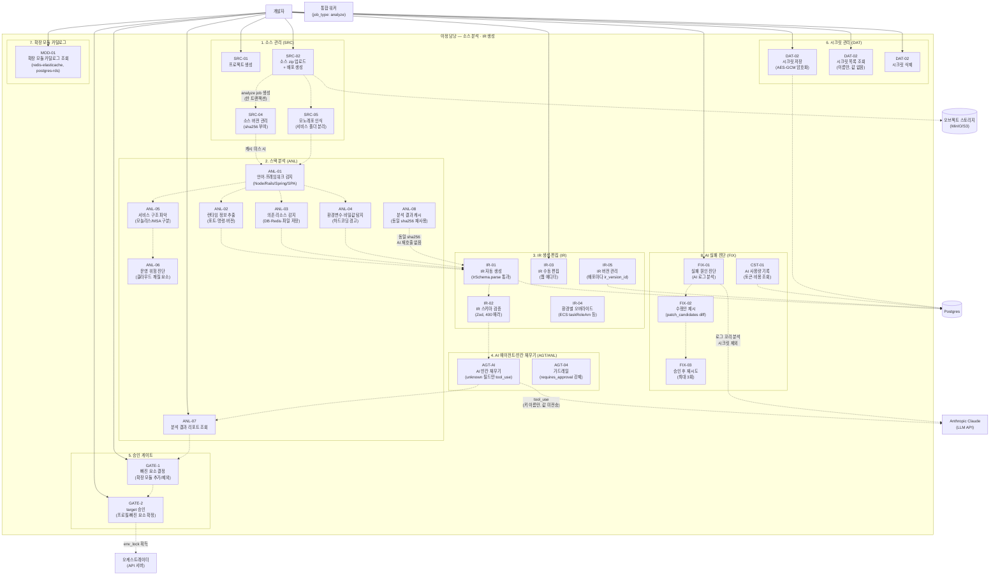

# 이정 담당 Use Case Diagram — 소스 분석 · IR 생성

> 담당 범위: 소스 업로드부터 IR 생성·편집·승인까지의 전 단계. 분석 파이프라인의 진입점이며 후속 빌드·프로비저닝 단계의 입력을 생성한다.

---

## Use Case Diagram

---

## 코드 매핑 표

| Use Case | 기능 ID | 파일 위치 | 담당 API |
|---|---|---|---|
| 프로젝트 생성 | SRC-01 | `apps/api/src/routes/` | `POST /api/v1/projects` (API-02) |
| 소스 zip 업로드 + 배포 생성 | SRC-02 | `apps/api/src/routes/` | `POST /api/v1/deployments` (API-05) |
| 소스 버전 관리 (sha256) | SRC-04 | `apps/api/src/routes/` | `POST /api/v1/deployments` (API-05 내부) |
| 모노레포 인식 | SRC-05 | `packages/analyzer/src/service-splitter.ts` | `GET /deployments/:id/analysis-report` (API-19) |
| 언어·프레임워크 감지 | ANL-01 | `packages/analyzer/src/detectors/nodejs.ts`, `python.ts`, `rails.ts` | 워커 내부 |
| 런타임 정보 추출 | ANL-02 | `packages/analyzer/src/detectors/` | 워커 내부 |
| 의존 리소스 감지 | ANL-03 | `packages/analyzer/src/detectors/` | 워커 내부 |
| 환경변수·비밀값 탐지 | ANL-04 | `packages/analyzer/src/detectors/` | 워커 내부 |
| 서비스 구조 파악 | ANL-05 | `packages/analyzer/src/service-splitter.ts` | 워커 내부 |
| 운영 위험 진단 | ANL-06 | `packages/analyzer/src/` | 워커 내부 |
| 분석 결과 리포트 조회 | ANL-07 | `apps/api/src/routes/` | `GET /deployments/:id/analysis-report` (API-19) |
| 분석 결과 캐시 | ANL-08 | `packages/analyzer/src/index.ts` | 워커 내부 (sha256 비교) |
| IR 자동 생성 | IR-01 | `packages/ir-schema/src/index.ts` | `GET /deployments/:id/ir` (API-08) |
| IR 스키마 검증 | IR-02 | `packages/ir-schema/src/index.ts` (IrSchema.parse) | `GET /deployments/:id/ir` (API-08) |
| IR 수동 편집 | IR-03 | `apps/api/src/routes/` | `PATCH /deployments/:id/ir` (API-09) |
| 환경별 오버라이드 | IR-04 | `packages/ir-schema/src/index.ts` | `PATCH /deployments/:id/ir` (API-09) |
| IR 버전 관리 | IR-05 | `apps/api/src/routes/` | `PATCH /deployments/:id/ir` (API-09) |
| AI 빈칸 채우기 | AGT/ANL | `packages/analyzer/src/ai-filler.ts` | 워커 내부 |
| 가드레일 | AGT-04 | `apps/api/src/routes/` | `POST /deployments/:id/approvals` (API-11) |
| 빠진 요소 결정 | IR/PRV | `apps/api/src/routes/` | `POST /deployments/:id/missing-resources` (API-10) |
| target 승인 | DEP/LCK | `apps/api/src/routes/` | `POST /deployments/:id/approvals` (API-11, gate=target) |
| 시크릿 저장 | DAT-02 | `apps/api/src/routes/` | `POST /api/v1/secrets` (API-28) |
| 시크릿 목록 조회 | DAT-02 | `apps/api/src/routes/` | `GET /api/v1/secrets` (API-29) |
| 시크릿 삭제 | DAT-02 | `apps/api/src/routes/` | `DELETE /api/v1/secrets/:name` (API-30) |
| 확장 모듈 카탈로그 조회 | REC | `apps/api/src/routes/` | `GET /api/v1/modules` (API-27) |
| 실패 원인 진단 | FIX-01 | `apps/api/src/routes/` | `GET /deployments/:id/diagnosis` (API-36) |
| 수정안 제시 | FIX-02 | `apps/api/src/routes/` | `GET /deployments/:id/diagnosis` (API-36, patchCandidates) |
| 승인 후 재시도 | FIX-03 | `apps/api/src/routes/` | `POST /deployments/:id/rollback` (API-13) |
| AI 사용량 기록 | CST-01 | `apps/api/src/routes/` | `GET /deployments/:id/ai-usage` (API-32) |

---

## 관련 API 엔드포인트 요약

| 우선순위 | 메서드 | 경로 | 설명 |
|---|---|---|---|
| P0 | POST | `/api/v1/projects` | 프로젝트 생성 |
| P0 | POST | `/api/v1/deployments` | 소스 업로드 + 배포 생성 (multipart) |
| P0 | GET | `/api/v1/deployments/:id/ir` | IR 조회 |
| P0 | POST | `/api/v1/deployments/:id/missing-resources` | 빠진 요소 결정 |
| P0 | POST | `/api/v1/deployments/:id/approvals` | 승인 게이트 (target/plan) |
| P0 | GET | `/api/v1/deployments/:id/analysis-report` | 분석 리포트 조회 |
| P1 | PATCH | `/api/v1/deployments/:id/ir` | IR 수동 편집 |
| P1 | GET | `/api/v1/modules` | 확장 모듈 카탈로그 |
| P1 | POST | `/api/v1/secrets` | 시크릿 저장 |
| P1 | GET | `/api/v1/secrets` | 시크릿 목록 조회 |
| P1 | DELETE | `/api/v1/secrets/:name` | 시크릿 삭제 |
| P1 | GET | `/api/v1/deployments/:id/diagnosis` | AI 실패 진단 |
| P1 | GET | `/api/v1/deployments/:id/ai-usage` | AI 토큰·비용 조회 |
