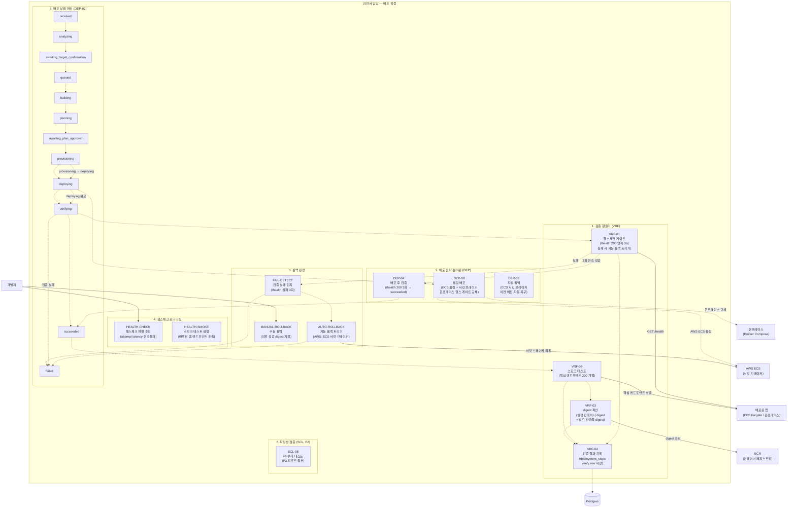

# 김민서 담당 Use Case Diagram — 배포 검증

> 담당 범위: 배포 완료 후 헬스체크, 스모크 테스트, digest 확인, 롤아웃 검증, 자동 롤백 판정까지. 배포 파이프라인의 최종 품질 게이트를 담당한다.

---

## Use Case Diagram

---

## 코드 매핑 표

| Use Case | 기능 ID | 파일 위치 | 담당 API |
|---|---|---|---|
| 헬스체크 게이트 (연속 3회) | VRF-01 | `apps/worker/src/handlers/verify.ts` | `GET /deployments/:id/health` (API-21) |
| 스모크 테스트 | VRF-02 | `apps/worker/src/handlers/verify.ts` | `GET /deployments/:id/health` (API-21) |
| digest 확인 | VRF-03 | `apps/worker/src/handlers/verify.ts` | `GET /deployments/:id/health` (API-21, D-53 범위 미결) |
| 검증 결과 기록 | VRF-04 | `apps/worker/src/handlers/verify.ts` | `GET /deployments/:id/health` (API-21) |
| 배포 후 검증 | DEP-04 | `apps/worker/src/handlers/verify.ts` | 워커 내부 |
| 롤링 배포 | DEP-08 | `apps/worker/src/handlers/provision.ts` | 워커 내부 |
| 자동 롤백 | DEP-09 | `apps/worker/src/handlers/verify.ts` | 워커 내부 (ECS 서킷 브레이커) |
| 헬스체크 현황 조회 | VRF-01 | `apps/api/src/routes/` | `GET /deployments/:id/health` (API-21) |
| 배포 상태 머신 | DEP-02 | `apps/api/src/` + `apps/worker/src/` | `GET /deployments/:id` (API-06) |
| 수동 롤백 | DEP-05 | `apps/api/src/routes/` | `POST /deployments/:id/rollback` (API-13) |
| k6 부하 테스트 | SCL-05 | 별도 k6 스크립트 (P2) | - |

---

## 검증 판정 기준 (완료 조건)

| 검증 항목 | 판정 기준 | 결과 |
|---|---|---|
| VRF-01 헬스체크 | `/health` 200 응답 연속 3회 | 통과 → `succeeded`, 실패 → 자동 롤백 트리거 |
| VRF-02 스모크 | 핵심 엔드포인트 200 계열 응답 | 통과 → 기록, 실패 → `failed` |
| VRF-03 digest | 실행 컨테이너 digest = 빌드 digest | D-53 Q3 범위 미결 (A=전달값 비교 / B=실제 조회) |
| VRF-04 기록 | `deployment_steps` verify row 저장 | 항상 기록 |

---

## 관련 API 엔드포인트 요약

| 우선순위 | 메서드 | 경로 | 설명 |
|---|---|---|---|
| P0 | GET | `/api/v1/deployments/:id/health` | 헬스체크 현황 조회 |
| P0 | GET | `/api/v1/deployments/:id` | 배포 상태 (상태 머신) |
| P0 | GET | `/api/v1/deployments/:id/events` | SSE 실시간 상태 스트림 |
| P1 | POST | `/api/v1/deployments/:id/rollback` | 수동 롤백 |
| P2 | - | k6 부하 테스트 스크립트 | 별도 스크립트 (SCL-05) |
