# 김민성 담당 Use Case Diagram — 웹 대시보드 · 프론트엔드

> 담당 범위: 웹 대시보드 전체 UI. 프로젝트 관리, 배포 생성·진행 표시(SSE), 분석 리포트, IR 편집, 프로필 선택, 플랜 승인, 로그 조회, 이벤트 스트림까지. API 소비자 관점의 모든 화면을 담당한다.

---

## Use Case Diagram

```mermaid
graph TB
  Dev[개발자]
  API["API 서버\n(Fastify)"]
  SSE["SSE 스트림\n(state_changed\nanalysis.progress\napproval_requested)"]

  subgraph Minseong ["김민성 담당 — 웹 대시보드 · 프론트엔드"]
    direction TB

    subgraph PROJ ["1. 프로젝트 관리 화면"]
      UC01["PROJ-LIST\n프로젝트 목록 조회\n(커서 페이지네이션)"]
      UC02["PROJ-DETAIL\n프로젝트 상세 조회"]
      UC03["PROJ-CREATE\n새 프로젝트 생성 폼"]
    end

    subgraph DEPLOY ["2. 배포 생성 화면"]
      UC04["DEP-UPLOAD\n소스 zip 업로드 UI\n(multipart 전송)"]
      UC05["DEP-PROFILE\n배포 프로필 선택\n(aws-ecs-basic\nonprem-docker-basic)"]
      UC06["DEP-SUBMIT\n배포 시작\n(POST /deployments)"]
    end

    subgraph PROGRESS ["3. 배포 진행 화면 (실시간)"]
      UC07["PROG-SSE\nSSE 스트림 연결\n(state_changed 이벤트)"]
      UC08["PROG-STATUS\n단계별 상태 실시간 갱신\n(분석→빌드→플랜→배포→검증)"]
      UC09["PROG-ANALYSIS\n분석 진행 표시\n(analysis.progress 이벤트)"]
      UC10["PROG-APPROVAL\n승인 게이트 알림\n(approval_requested 이벤트)"]
      UC11["PROG-LOCK\n환경 락 상태 표시\n(lock.changed 이벤트)"]
    end

    subgraph ANALYSIS ["4. 분석 리포트 화면"]
      UC12["ANL-REPORT\n분석 결과 리포트 조회\n(스택·리소스·경고·미결)"]
      UC13["ANL-WARN\n운영 위험 경고 표시\n(HARDCODED_SECRET\nNO_HEALTH_CHECK)"]
    end

    subgraph IR_UI ["5. IR 편집 화면 (P1)"]
      UC14["IR-VIEW\nIR(앱 명세 YAML) 조회\n(JSON → 웹 에디터)"]
      UC15["IR-EDIT\nIR 수동 편집·저장\n(낙관적 락 version 필드)"]
      UC16["IR-MISSING\n빠진 요소 결정 UI\n(확장 모듈 추가/제외)"]
    end

    subgraph APPROVE ["6. 승인 게이트 화면"]
      UC17["GATE-TARGET\ntarget 승인 화면\n(프로필·빠진 요소 확정)"]
      UC18["GATE-PLAN\nTerraform 플랜 미리보기\n(리소스 목록·예상 비용)"]
      UC19["GATE-APPROVE\n플랜 승인·거부 버튼"]
    end

    subgraph PROFILE_UI ["7. 프로필 카탈로그 화면"]
      UC20["PROFILE-LIST\n프로필 카탈로그 목록\n(AWS ECS / 온프레미스)"]
      UC21["PROFILE-DETAIL\n프로필 상세\n(capabilities·월 예상 비용)"]
    end

    subgraph LOG_UI ["8. 로그·이력 화면"]
      UC22["LOG-HISTORY\n배포 이력 목록\n(상태·버전·날짜)"]
      UC23["LOG-DETAIL\n배포 상세 로그 조회\n(단계별 필터)"]
      UC24["LOG-STREAM\n실시간 로그 스트리밍 UI\n(SSE log_line 이벤트)"]
    end

    subgraph HEALTH_UI ["9. 헬스체크·검증 화면"]
      UC25["HEALTH-VIEW\n헬스체크 현황 조회\n(attempt·consecutivePassed)"]
      UC26["URL-VIEW\n배포 완료 URL 표시\n(public_url)"]
    end

    subgraph ROLLBACK_UI ["10. 롤백 화면 (P1)"]
      UC27["ROLLBACK-BTN\n롤백 버튼\n(이전 성공 배포 선택)"]
    end

    subgraph SW_UI ["11. 환경 전환 화면 (P1)"]
      UC28["SW-UI\nAWS ↔ 온프레미스\n전환 버튼 및 상태 표시"]
    end
  end

  %% 개발자 액션 (웹 UI 통해서)
  Dev --> UC03
  Dev --> UC04
  Dev --> UC05
  Dev --> UC06
  Dev --> UC16
  Dev --> UC17
  Dev --> UC19
  Dev --> UC27
  Dev --> UC28

  %% 조회성 액션
  Dev --> UC01
  Dev --> UC02
  Dev --> UC12
  Dev --> UC14
  Dev --> UC18
  Dev --> UC20
  Dev --> UC22
  Dev --> UC23
  Dev --> UC25

  %% 자동 화면 업데이트 (SSE)
  SSE -.->|"state_changed"| UC08
  SSE -.->|"analysis.progress"| UC09
  SSE -.->|"approval_requested"| UC10
  SSE -.->|"lock.changed"| UC11
  SSE -.->|"log_line"| UC24
  UC06 -.->|"SSE 스트림 오픈"| UC07
  UC07 -.-> SSE

  %% 배포 생성 흐름
  UC04 -.-> UC05
  UC05 -.-> UC06
  UC06 -.-> UC08

  %% 승인 게이트 흐름
  UC10 -.-> UC17
  UC17 -.-> UC18
  UC18 -.-> UC19

  %% IR 편집 흐름
  UC14 -.-> UC15
  UC12 -.-> UC16

  %% 완료 후
  UC08 -.->|"succeeded"| UC26
  UC08 -.->|"succeeded"| UC25

  %% API 호출
  UC01 -->|"GET /projects"| API
  UC02 -->|"GET /projects/:id"| API
  UC03 -->|"POST /projects"| API
  UC06 -->|"POST /deployments"| API
  UC08 -->|"GET /deployments/:id"| API
  UC12 -->|"GET /deployments/:id/analysis-report"| API
  UC14 -->|"GET /deployments/:id/ir"| API
  UC15 -->|"PATCH /deployments/:id/ir"| API
  UC18 -->|"GET /deployments/:id/plan"| API
  UC19 -->|"POST /deployments/:id/approvals"| API
  UC20 -->|"GET /profiles"| API
  UC21 -->|"GET /profiles/:id"| API
  UC22 -->|"GET /projects/:id/deployments"| API
  UC23 -->|"GET /deployments/:id/logs"| API
  UC25 -->|"GET /deployments/:id/health"| API
  UC27 -->|"POST /deployments/:id/rollback"| API
  UC28 -->|"POST /environments/:id/switch"| API
```

---

## 코드 매핑 표

| Use Case | 기능 ID | 파일 위치 | 소비 API |
|---|---|---|---|
| 프로젝트 목록 조회 | SRC-01 | `apps/web/src/pages/projects/` | `GET /api/v1/projects` (API-03) |
| 프로젝트 상세 조회 | SRC-01 | `apps/web/src/pages/projects/[id]/` | `GET /api/v1/projects/:id` (API-04) |
| 새 프로젝트 생성 폼 | SRC-01 | `apps/web/src/pages/projects/new` | `POST /api/v1/projects` (API-02) |
| 소스 zip 업로드 UI | SRC-02 | `apps/web/src/components/deploy/` | `POST /api/v1/deployments` (API-05) |
| 배포 프로필 선택 | REC-04 | `apps/web/src/components/deploy/` | `GET /api/v1/profiles` (API-17) |
| 배포 시작 | DEP-01 | `apps/web/src/components/deploy/` | `POST /api/v1/deployments` (API-05) |
| SSE 스트림 연결 | DEP-03 | `apps/web/src/hooks/useDeploymentEvents.ts` | `GET /api/v1/deployments/:id/events` (API-07) |
| 단계별 상태 실시간 갱신 | DEP-03 | `apps/web/src/pages/deployments/[id]/` | `GET /api/v1/deployments/:id` (API-06) |
| 분석 결과 리포트 | ANL-07 | `apps/web/src/pages/deployments/[id]/analysis` | `GET /api/v1/deployments/:id/analysis-report` (API-19) |
| IR 조회 | IR-01 | `apps/web/src/pages/deployments/[id]/ir` | `GET /api/v1/deployments/:id/ir` (API-08) |
| IR 수동 편집 | IR-03 | `apps/web/src/pages/deployments/[id]/ir` | `PATCH /api/v1/deployments/:id/ir` (API-09) |
| 빠진 요소 결정 UI | PRV | `apps/web/src/components/approval/` | `POST /api/v1/deployments/:id/missing-resources` (API-10) |
| target 승인 화면 | AGT-04 | `apps/web/src/components/approval/` | `POST /api/v1/deployments/:id/approvals` (API-11) |
| Terraform 플랜 미리보기 | PRV-02 | `apps/web/src/pages/deployments/[id]/plan` | `GET /api/v1/deployments/:id/plan` (API-20) |
| 플랜 승인·거부 | PRV-02 | `apps/web/src/components/approval/` | `POST /api/v1/deployments/:id/approvals` (API-11) |
| 프로필 카탈로그 목록 | REC-04 | `apps/web/src/pages/profiles/` | `GET /api/v1/profiles` (API-17) |
| 프로필 상세 | REC-04 | `apps/web/src/pages/profiles/[id]/` | `GET /api/v1/profiles/:id` (API-18) |
| 배포 이력 목록 | LOG-01 | `apps/web/src/pages/projects/[id]/deployments` | `GET /api/v1/projects/:id/deployments` (API-22) |
| 배포 상세 로그 | LOG-02 | `apps/web/src/pages/deployments/[id]/logs` | `GET /api/v1/deployments/:id/logs` (API-12) |
| 실시간 로그 스트리밍 | LOG-02 | `apps/web/src/pages/deployments/[id]/logs` | `GET /api/v1/deployments/:id/logs/stream` (API-35) |
| 헬스체크 현황 | VRF-01 | `apps/web/src/pages/deployments/[id]/health` | `GET /api/v1/deployments/:id/health` (API-21) |
| 배포 완료 URL 표시 | NET-01 | `apps/web/src/pages/deployments/[id]/` | `GET /api/v1/deployments/:id` (API-06) |
| 롤백 버튼 | DEP-05 | `apps/web/src/components/deploy/` | `POST /api/v1/deployments/:id/rollback` (API-13) |
| 환경 전환 UI | SW-01~03 | `apps/web/src/pages/deployments/[id]/` | `POST /api/v1/environments/:id/switch` (API-39) |

---

## 소비 API 엔드포인트 요약

| 우선순위 | 메서드 | 경로 | UI 화면 |
|---|---|---|---|
| P0 | GET | `/api/v1/projects` | 프로젝트 목록 |
| P0 | GET | `/api/v1/projects/:id` | 프로젝트 상세 |
| P0 | POST | `/api/v1/projects` | 프로젝트 생성 폼 |
| P0 | POST | `/api/v1/deployments` | 배포 생성 |
| P0 | GET | `/api/v1/deployments/:id` | 배포 상태 |
| P0 | GET | `/api/v1/deployments/:id/events` | SSE 실시간 진행 |
| P0 | GET | `/api/v1/deployments/:id/analysis-report` | 분석 리포트 |
| P0 | GET | `/api/v1/deployments/:id/ir` | IR 조회 |
| P0 | POST | `/api/v1/deployments/:id/approvals` | 승인 게이트 |
| P0 | GET | `/api/v1/deployments/:id/plan` | Terraform 플랜 |
| P0 | GET | `/api/v1/deployments/:id/health` | 헬스체크 현황 |
| P0 | GET | `/api/v1/profiles` | 프로필 목록 |
| P0 | GET | `/api/v1/profiles/:id` | 프로필 상세 |
| P0 | GET | `/api/v1/projects/:id/deployments` | 배포 이력 |
| P0 | GET | `/api/v1/deployments/:id/logs` | 로그 조회 |
| P1 | PATCH | `/api/v1/deployments/:id/ir` | IR 편집 |
| P1 | POST | `/api/v1/deployments/:id/rollback` | 롤백 |
| P1 | POST | `/api/v1/environments/:id/switch` | 환경 전환 |
| P1 | GET | `/api/v1/deployments/:id/logs/stream` | 실시간 로그 |
