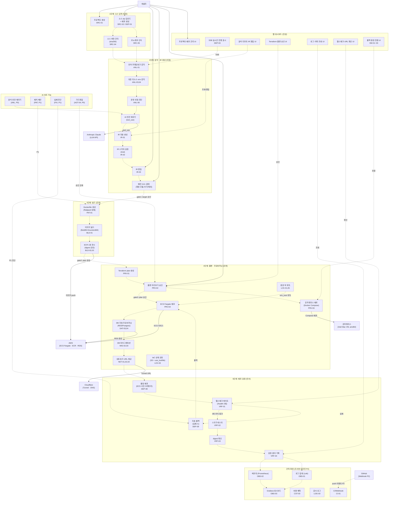
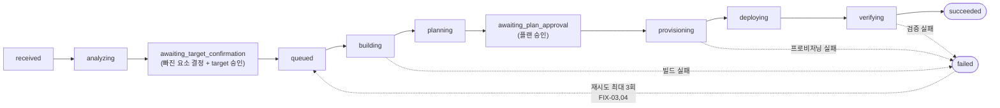

# 전체 시스템 Use Case Diagram — 통합 뷰

> Camellia 배포 시스템의 전체 use case 통합 뷰. 5단계 파이프라인 흐름과 담당자별 영역을 한 다이어그램에서 조망한다.

---

## 전체 시스템 통합 Use Case Diagram

---

## 담당자별 Use Case 요약

| 담당자 | 파이프라인 단계 | 주요 기능 ID | Use Case 수 |
|---|---|---|---|
| **이정** | 1~2단계 (소스·분석·IR) | SRC, ANL, IR, AGT, FIX, DAT(시크릿), CST | 29개 |
| **신은영** | 3~4단계 (빌드·프로비저닝·락) | BLD, PRV, DAT, MIG, NET, LCK, SW, AGT(에이전트) | 34개 |
| **김민서** | 5단계 (검증) | VRF, DEP(롤아웃·롤백), SCL(k6 P2) | 11개 |
| **김민성** | 웹 대시보드 | UI, 전체 API 소비 | 24개 |
| **조서현·안우진** | 관측·확장 (P2) | OBS, CST, LOG(감사), CI, SCL, USR | 18개 |

---

## 5단계 파이프라인 상태 전이

---

## 전체 API 엔드포인트 커버리지

| 구분 | 수 | 담당 |
|---|---|---|
| P0 API | 21개 | 이정·은영·민서·민성 |
| P1 API | 18개 | 이정·은영·민서·민성·서현/우진 |
| P2 API | 9개 | 서현/우진·공통 |
| **합계** | **48개** | — |

---

## 커버 안 되는 기능 (명시)

| 기능 ID | 설명 | 사유 |
|---|---|---|
| CST-02 | `GET /analytics/ai-roi` | V-01 미결 — 엔드포인트 미명세 (P1) |
| PRV-10 | 함수형 서버리스 어댑터 (Lambda) | P2, 시간 여유 시 구현 |
| PRV-11 | 인스턴스 어댑터 (EC2) | P2, 시간 여유 시 구현 |
| PRV-05 | GCP Cloud Run 어댑터 | P2 |
| PRV-06 | Azure Container Apps 어댑터 | P2 |
| DEP-06 | 블루그린 배포 | P2 |
| DEP-07 | 카나리 배포 | P2 |
| OBS-04 | 트레이스 | 폐기 (D-45) |
| OBS-05 | 프로파일링 (Pyroscope) | 폐기 (D-45) |
| IR-06 | Docker Compose 호환 | 폐기 (D-35) |
| BLD-05 | 멀티 아키텍처 빌드 | 폐기 (D-33) |
| LCK-04 | 개인 미리보기 환경 | 폐기 |
