# 조서현·안우진 잠정 담당 Use Case Diagram — 관측 · 확장

> 담당 범위 (잠정): 메트릭·로그·관측 대시보드, 비용 예측, 감사 로그, CI/Webhook 연동. 전체 P2 우선순위 (D-45: 관측 P2). P0/P1 완료 후 구현 대상.

---

## Use Case Diagram

```mermaid
graph TB
  Dev[개발자]
  Prometheus["Prometheus\n(메트릭 수집)"]
  Grafana["Grafana\n(시각화)"]
  Loki["Loki\n(로그 집계)"]
  GitHub["GitHub\n(Webhook)"]
  CostExplorer["AWS Cost Explorer\n(실제 청구)"]

  subgraph Shared ["조서현·안우진 잠정 — 관측 · 확장 (P2)"]
    direction TB

    subgraph OBS ["1. 관측 (OBS) — P2"]
      UC01["OBS-01\n배포 단계 로그 집계\n(Loki 통합 조회)"]
      UC02["OBS-02\n메트릭 수집\n(CPU·메모리·요청 수\nPrometheus)"]
      UC03["OBS-03\n시각화 대시보드\n(Grafana 메트릭·로그 그래프)"]
      UC06["OBS-06\n자동 관측 구성\n(Prometheus scrape\nconfig 자동 등록)"]
    end

    subgraph COST ["2. 비용 (CST) — P1/P2"]
      UC07["CST-01\nAI 사용량 기록\n(배포당 토큰·비용)"]
      UC08["CST-02\nAI 효과 지표\n(자동 복구 성공률\nGET /analytics/ai-roi)"]
      UC09["CST-03\n인프라 비용 예측\n(프로필+크기 → $/월)"]
      UC10["CST-04\n비용 최적화 제안\n(scale-to-zero 추천 P2)"]
      UC11["COST-ACTUAL\n실제 청구 조회\n(AWS Cost Explorer)"]
    end

    subgraph AUDIT ["3. 감사 로그 (LOG-03) — P2"]
      UC12["LOG-03\n감사 로그 기록\n(설정 변경·시크릿 수정\n권한 변경 이력)"]
      UC13["AUDIT-QUERY\n감사 로그 조회\n(projectId·action 필터)"]
    end

    subgraph CI ["4. CI/CD 연동 (CI) — P2"]
      UC14["CI-01\nGit push 자동 배포\n(GitHub push 트리거)"]
      UC15["CI-02\nGitHub Actions 파일 생성"]
    end

    subgraph SCL ["5. 확장성 (SCL) — P1/P2"]
      UC16["SCL-01\n다중 서비스 배포\n(IR services[] 복수\n의존 순서 배포)"]
      UC17["SCL-02\n서비스 간 통신\n(ECS service connect\ncompose network)"]
      UC18["SCL-03\n오토스케일링\n(ECS AutoScaling 정책 P2)"]
      UC19["SCL-04\n리소스 한도 설정\n(IR size → ECS cpu/memory)"]
      UC20["SCL-05\nk6 부하 테스트\n(P2 리포트)"]
    end

    subgraph USR_EXT ["6. 사용자·팀 확장 (USR) — P2"]
      UC21["USR-02\n팀·권한 관리\n(팀 단위 프로젝트)"]
      UC22["USR-03\n운영 환경 승인\n(운영 배포 전 승인)"]
    end
  end

  %% 개발자 액션
  Dev --> UC03
  Dev --> UC09
  Dev --> UC13
  Dev --> UC11
  Dev --> UC16

  %% 관측 흐름
  UC02 -.->|"메트릭 수집"| Prometheus
  UC03 -.->|"Grafana 연동"| Grafana
  UC01 -.->|"로그 쿼리"| Loki
  UC06 -.->|"scrape config 등록"| Prometheus

  %% CI 흐름
  GitHub -.->|"push 이벤트\nX-GitHub-Event"| UC14
  UC14 -.->|"배포 트리거"| API

  %% 비용 흐름
  UC11 -.->|"비용 조회"| CostExplorer
  UC09 -.->|"가격 카탈로그"| API

  %% 감사 로그
  UC12 -.->|"audit_logs 테이블"| DB

  API["API 서버\n(Fastify)"]
  DB[(Postgres)]
```

---

## 코드 매핑 표

| Use Case | 기능 ID | 파일 위치 | 담당 API | 우선순위 |
|---|---|---|---|---|
| 배포 로그 집계 (Loki) | OBS-01 | `apps/api/src/routes/` | `GET /deployments/:id/logs` (API-12) | P2 |
| 메트릭 수집 (Prometheus) | OBS-02 | `apps/api/src/routes/` | `GET /deployments/:id/metrics` (API-40) | P2 |
| Grafana 시각화 대시보드 | OBS-03 | Grafana 설정 파일 | `GET /deployments/:id/metrics` (API-40) | P2 |
| 자동 관측 구성 | OBS-06 | `apps/worker/src/handlers/` | 워커 내부 | P2 |
| AI 사용량 기록 | CST-01 | `apps/api/src/routes/` | `GET /deployments/:id/ai-usage` (API-32) | P1 |
| AI 효과 지표 | CST-02 | `apps/api/src/routes/` | `GET /analytics/ai-roi` (미결 V-01) | P1 미결 |
| 인프라 비용 예측 | CST-03 | `apps/api/src/routes/` | `GET /projects/:id/cost/estimate` (API-31) | P1 |
| 비용 최적화 제안 | CST-04 | `apps/api/src/routes/` | - | P2 |
| 실제 청구 조회 | CST-04 | `apps/api/src/routes/` | `GET /projects/:id/cost/actual` (API-42) | P2 |
| 감사 로그 기록 | LOG-03 | `apps/api/src/` (미들웨어) | `GET /api/v1/audit-logs` (API-41) | P2 |
| 감사 로그 조회 | LOG-03 | `apps/api/src/routes/` | `GET /api/v1/audit-logs` (API-41) | P2 |
| Git push 자동 배포 | CI-01 | `apps/api/src/routes/webhooks.ts` | `POST /webhooks/github` (API-46) | P2 |
| GitHub Actions 생성 | CI-02 | - | `GET /ci/workflow` (미결 V-03) | P2 |
| 다중 서비스 배포 | SCL-01 | `apps/worker/src/handlers/provision.ts` | 워커 내부 | P1 |
| 서비스 간 통신 | SCL-02 | `packages/profiles/aws-ecs-basic/` | 워커 내부 | P1 |
| 오토스케일링 | SCL-03 | `packages/profiles/aws-ecs-basic/` | 워커 내부 | P2 |
| 리소스 한도 설정 | SCL-04 | `packages/ir-schema/src/` | 워커 내부 | P1 |
| k6 부하 테스트 | SCL-05 | 별도 k6 스크립트 | - | P2 |
| 팀·권한 관리 | USR-02 | `apps/api/src/routes/` | `POST /api/v1/teams` (API-43~45) | P2 |

---

## 관련 API 엔드포인트 요약

| 우선순위 | 메서드 | 경로 | 설명 |
|---|---|---|---|
| P1 | GET | `/api/v1/projects/:id/cost/estimate` | 비용 예측 |
| P1 | GET | `/api/v1/deployments/:id/ai-usage` | AI 사용량 조회 |
| P1 미결 | GET | `/api/v1/analytics/ai-roi` | AI 효과 지표 (V-01 미결) |
| P2 | GET | `/api/v1/deployments/:id/metrics` | 메트릭 조회 |
| P2 | GET | `/api/v1/audit-logs` | 감사 로그 조회 |
| P2 | GET | `/api/v1/projects/:id/cost/actual` | 실제 청구 비용 |
| P2 | POST | `/api/v1/teams` | 팀 생성 |
| P2 | GET | `/api/v1/teams` | 팀 목록 |
| P2 | POST | `/api/v1/teams/:id/members` | 팀 멤버 추가 |
| P2 | POST | `/api/v1/webhooks/github` | GitHub 웹훅 수신 |
